<div align="center">

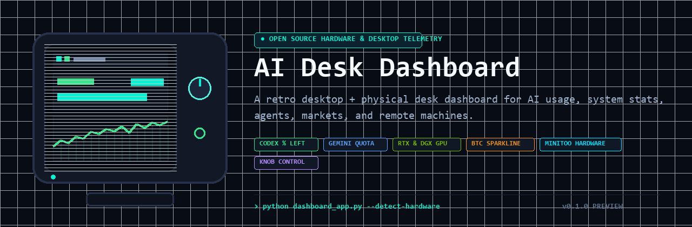

# AI Desk Dashboard

**A retro desktop + physical desk dashboard for AI usage, system stats, multi-asset markets, stock scanner, and remote machines.**

[](https://www.python.org/)
[](https://www.microsoft.com/windows)
[](LICENSE)
[-00F5D4?style=flat-square)](#supported-hardware)
[](docs/RELEASE_NOTES_v0.1.0.md)

</div>

---

## ⚡ Highlights

- **High-DPI Desktop Command Center (Milestone 14)**:
  - True Windows **Per-Monitor-V2 DPI Awareness** (`SetProcessDpiAwarenessContext(-4)`), rendering razor-sharp text and graphics on 100%, 125%, 150%, 175%, and 200% display scaling without blurry OS bitmap virtualization.
  - Centralized **UI Scale Engine** (`ui_scale.py`) with user-selectable scaling: `AUTO`, `100%`, `125%`, `150%`, `175%`, `200%`.
  - Modern default command center geometry (**1240×780**), with full window state restoration (width, height, x/y position, maximized state).
- **Responsive Dynamic Card Grid**:
  - Automatically calculates column count based on available monitor width and readable min/max card bounds (260px – 420px).
  - On 1080p and 1440p displays, all 5 crypto assets (**BTC | ETH | SOL | DOGE | PEPE**) fit cleanly in a single spacious row without awkward stretching into ultra-wide rectangles.
- **Creator Capture Views (16:9 & 9:16 Shorts)**:
  - Dedicated filming modes for OBS, screen recording, and mobile video (YouTube Shorts, TikTok, Reels).
  - Clean composition stripped of settings buttons and debug clutter.
  - Dedicated **9:16 Vertical Shorts** stacked hero layout for instant mobile video production.
- **Keyboard & Mouse Command Shortcuts**:
  - `Ctrl+,` or `Ctrl+P`: Instant Settings Dialog
  - `1`: ALL Preset
  - `2`: AI Quotas Preset
  - `3`: CRYPTO Markets Preset
  - `4`: STOCKS Volatility Scanner Preset
  - `5`: SYSTEM Hardware Preset
  - `F11`: Fullscreen presentation mode
  - `Esc`: Quick exit from Fullscreen, Creator Mode, or Section Focus
- **Redesigned 5-Tab Settings UX**: Clean, retro left-navigation layout (**GENERAL**, **DASHBOARD**, **MINITOO**, **INTEGRATIONS**, **ADVANCED**).
- **Independent Desktop vs MiniToo Visibility**: Configure card visibility separately for the desktop application vs physical desk display (`BTC: Desktop [x] MiniToo [x]`, `Coding: Desktop [x] MiniToo [ ]`).
- **Bluetooth Coexistence Engine**:
  - Solves real-world Bluetooth headphone and speaker audio stuttering caused by serial polling contention on shared radios (e.g., MediaTek RZ616 / Intel AX211).
  - Selectable **NORMAL** vs **LOW INTERFERENCE** transport modes.
  - Reduced knob polling from 16 Hz down to ~2.8–4 Hz; decoupled background collector refreshes from display transmissions; completely elides redundant identical frames (0 unnecessary transmissions).
  - Live rolling 60-second telemetry: SPP writes/min, reads/min, frames/min, throughput (KB/min), reconnects, and error counts under **Settings → MiniToo**. See [docs/BLUETOOTH.md](docs/BLUETOOTH.md).
- **Top 10 Volatile Stocks Scanner**: Objective intraday high-low range ranking with live prices, percentage deltas, and Yahoo Finance / Finnhub crumb session backends.
- **Authoritative AI Quotas (% LEFT)**: Tracks live, authoritative quotas for OpenAI Codex and Google Gemini / Antigravity with strict `% LEFT` semantics, plus Claude account diagnostic inspection (`no***@gmail.com`).
- **Zero Console Flashing on Windows**: Subprocesses execute silently via `subproc.py` using `CREATE_NO_WINDOW = 0x08000000` and `SW_HIDE`.

---

## 📸 Screenshots

### 1. 1080p Desktop Command Center (ALL Preset)
The high-resolution desktop command center showing all 4 responsive sections (Crypto Markets, AI Subscriptions, Volatile Stocks Scanner, Workstation Hardware & Services) with active MiniToo synchronization:

<div align="center">
  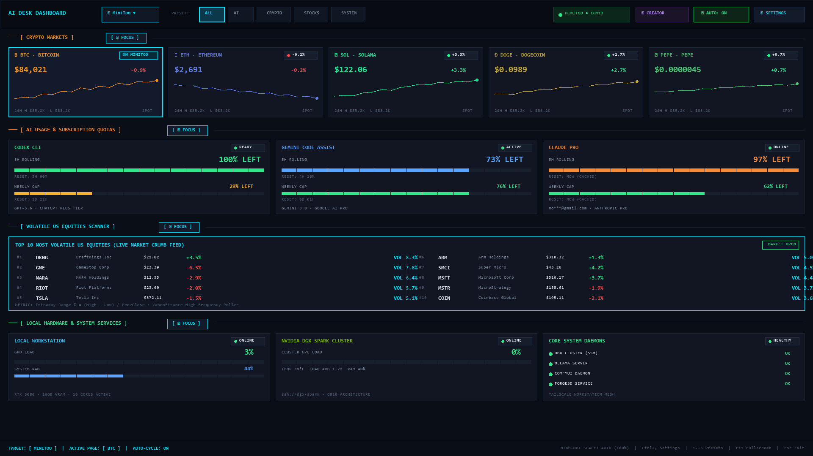
</div>

### 2. Creator Capture Mode (9:16 Vertical Shorts & Reels)
Zero-clutter presentation mode tailored for vertical filming (OBS / screen recording), featuring stacked crypto assets (BTC, ETH, SOL, DOGE, PEPE) and AI subscription quotas:

<div align="center">
  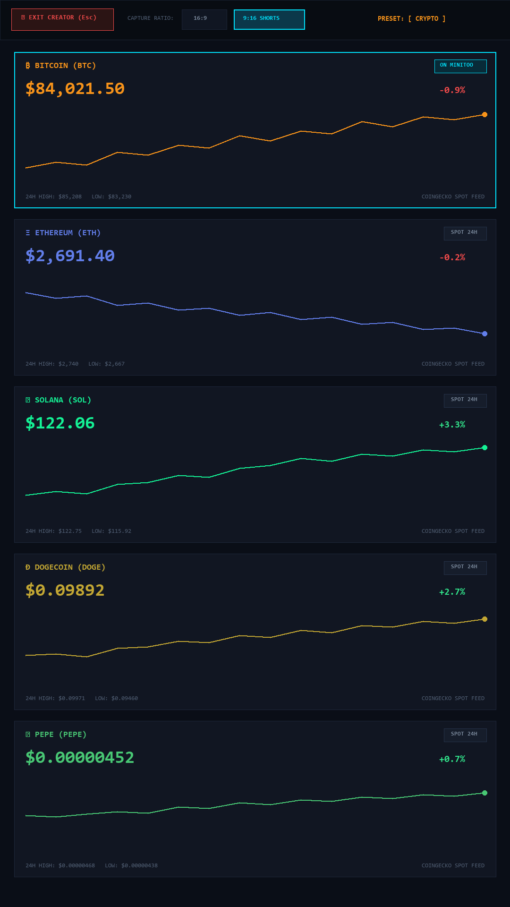
  &nbsp;&nbsp;&nbsp;&nbsp;
  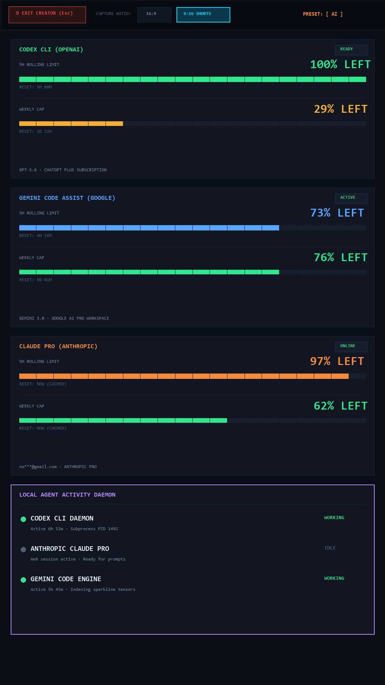
</div>

### 3. Crypto Hero Preset & Focus Presentation Mode
Expanded presentation view featuring 5-asset responsive layout, live spot prices, and 24-point phosphor sparklines for BTC, ETH, SOL, DOGE, and PEPE:

<div align="center">
  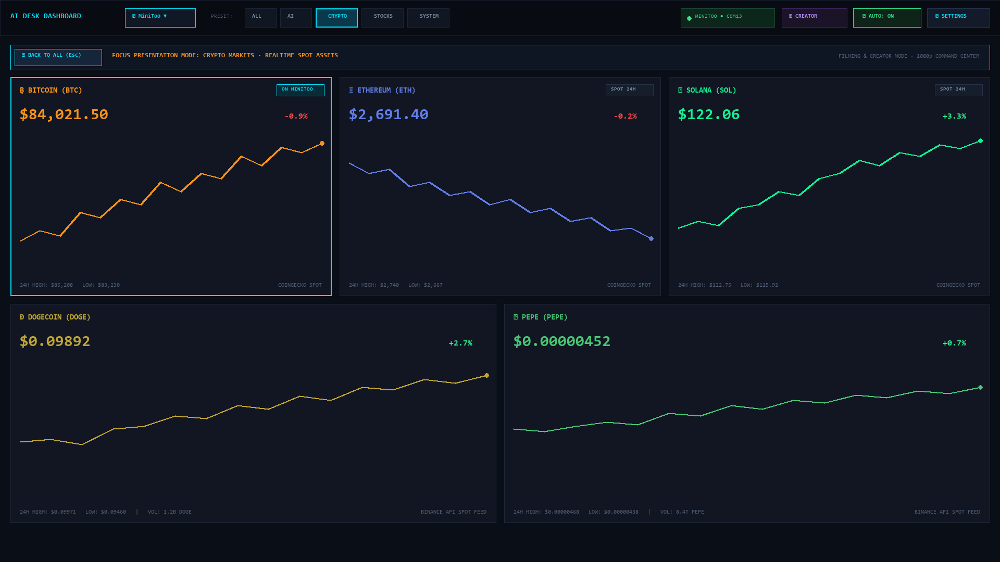
</div>

### 4. Stocks Volatility Scanner Terminal
Full-width financial ranking terminal emphasizing intraday volatility percentage, price, day change, range meter, and market session state:

<div align="center">
  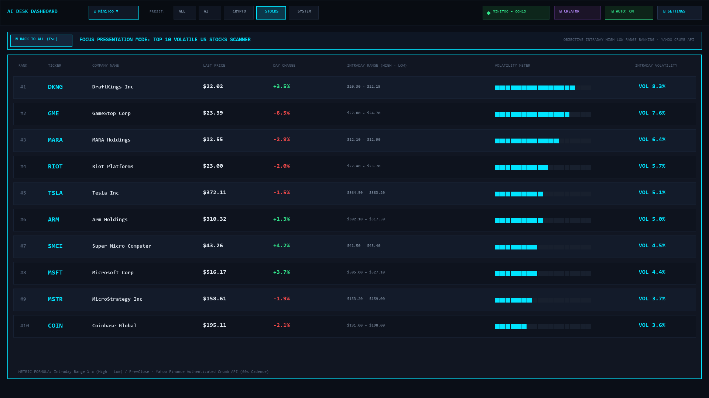
</div>

### 5. AI Subscription Quotas Preset (% LEFT & Reset Timers)
Authoritative quota visualization showing percentage remaining, 16-block segmented progress gauges, reset countdowns, and local AI agent activity daemons:

<div align="center">
  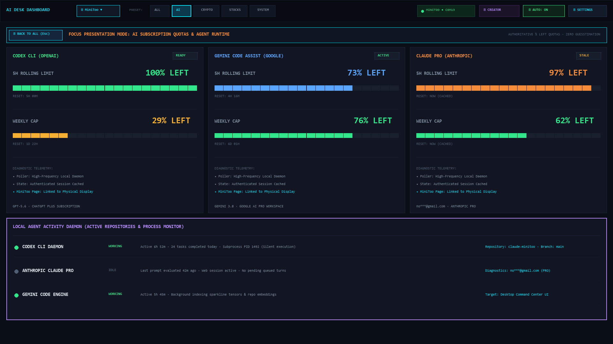
</div>

### 6. Workstation Hardware & Remote DGX Cluster Telemetry
Local RTX 5080 GPU telemetry, remote DGX Spark compute node load/VRAM, and internal service health checks:

<div align="center">
  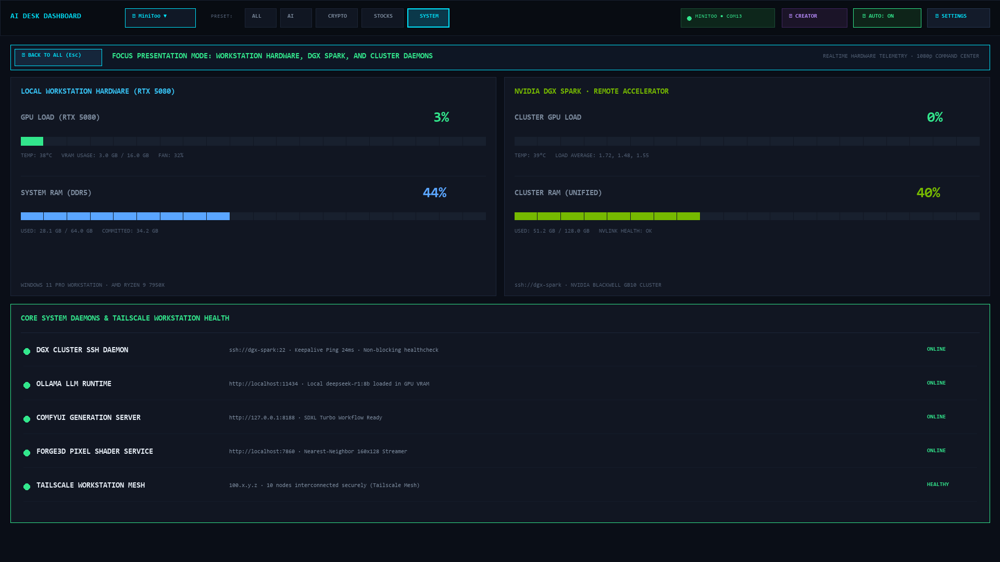
</div>

### 7. Scaled High-DPI Settings: Dashboard & Card Visibility
Left-navigation layout with centralized Desktop UI Scale options, independent `Desktop [x]` vs `MiniToo [x]` toggles, and per-item reordering arrows:

<div align="center">
  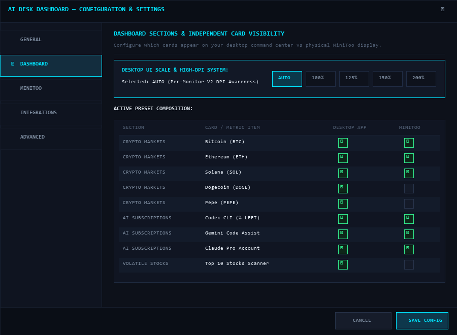
</div>

### 8. Scaled High-DPI Settings: MiniToo & Bluetooth Telemetry
Live 60-second rolling Bluetooth metrics, Low Interference mode toggle, dwell timing, and display diagnostics:

<div align="center">
  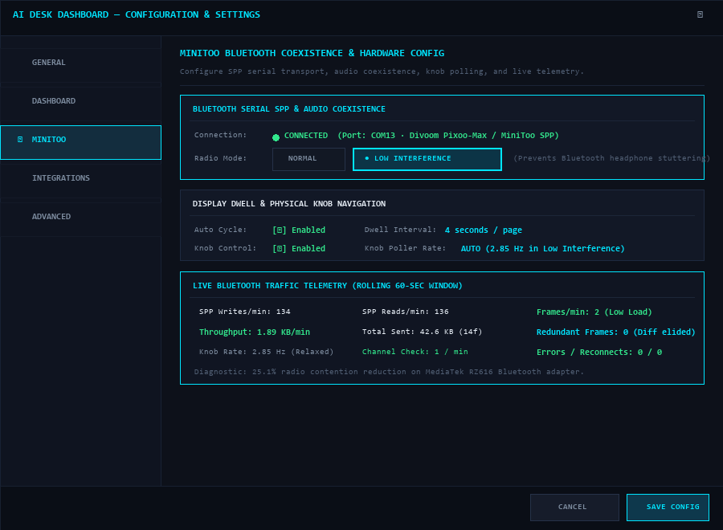
</div>

### 9. Physical MiniToo Desk Display
Live Gemini model quota running on a physical Divoom MiniToo 160×128 desk display:

<div align="center">
  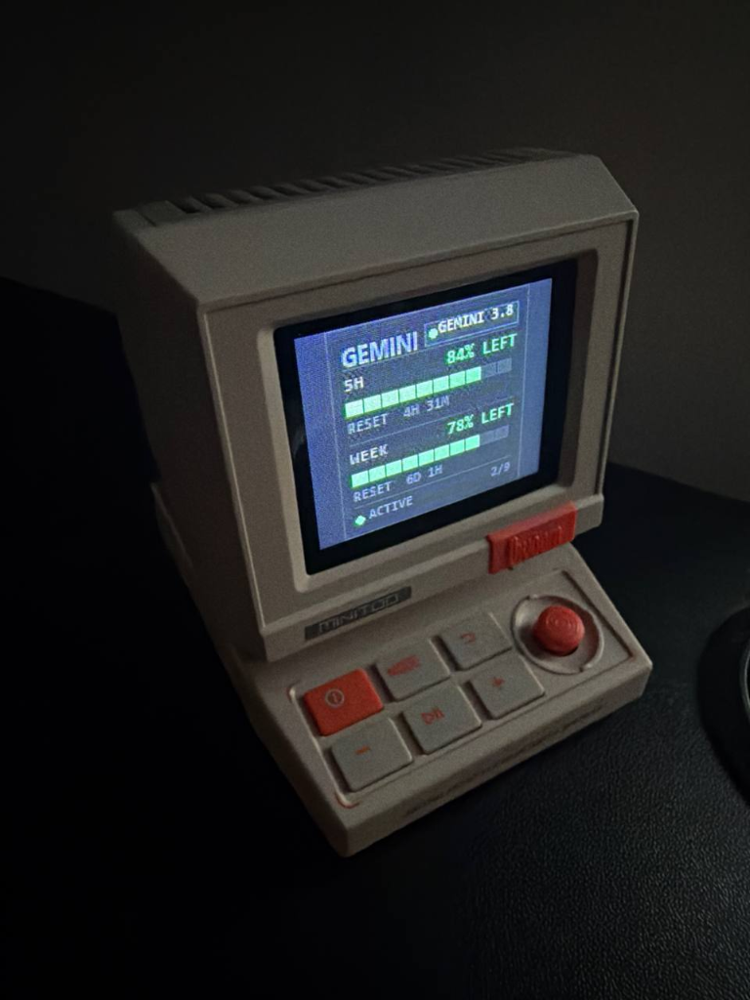
</div>
---

## 🚀 Quick Start

### Path A: Windows App (No Python Required)
1. Download the standalone executable from [Releases](https://github.com/Tacdelgineer/Divoom-display/releases): `AI Desk Dashboard.exe`.
2. *(Optional)* Pair your Divoom MiniToo with Windows via Bluetooth Settings.
3. Launch `AI Desk Dashboard.exe`.
4. The dashboard automatically discovers your MiniToo COM port and begins live desktop rendering.
5. Click **SETTINGS** to customize sections, reorder cards, toggle presets, or configure Claude accounts.

### Path B: Developer Setup

```powershell
# 1. Clone the repository
git clone https://github.com/Tacdelgineer/Divoom-display.git
cd Divoom-display

# 2. Create and activate a virtual environment
python -m venv venv
.\venv\Scripts\Activate.ps1

# 3. Install dependencies
pip install -r requirements.txt

# 4. Launch Desktop Dashboard
python dashboard_app.py
```

See [docs/INSTALL.md](docs/INSTALL.md) for complete installation instructions and optional provider configurations.

---

## 📊 Supported Sections & Data Sources

### 1. Crypto Markets Section
- **Assets**: BTC (Bitcoin), ETH (Ethereum), SOL (Solana), DOGE (Dogecoin), PEPE (Pepe).
- **Data Source**: CoinGecko Public Markets API.
- **Efficiency**: Consolidated single HTTP request for all 5 assets with 60-second caching (`.crypto_cache.json`).
- **Formatting**: Large numbers formatted cleanly (e.g. `$84,021`), micro-cent tokens formatted intelligently up to 7 decimal places (`$0.0000045`), and compact notation on MiniToo 128px displays (`$4.5u`).
- **Visuals**: Recognizable badge badges (`₿`, `Ξ`, `◎`, `Ð`, `🐸`) and 24-point phosphor sparklines with daily high/low.

### 2. AI Usage Section
- **OpenAI Codex**: Authoritative chatgpt backend API via `~/.codex/auth.json`. Displays 5-Hour and Weekly `% LEFT`.
- **Google Gemini / Antigravity**: Live Google backend quota via headless `agy -p /usage`. Displays 5-Hour and Weekly `% LEFT`.
- **Anthropic Claude Diagnostics**:
  - Exposes active account identity with privacy masking (`no***@gmail.com`).
  - Reports subscription plan (`Claude Pro`) and authentication type (`Subscription (OAuth)`).
  - Probes environment variables (`ANTHROPIC_API_KEY`, `CLAUDE_CODE_OAUTH_TOKEN`, etc.) and documents precedence.
  - Supports isolated secondary authentication directories (`~/.claude-secondary`) without credential scraping or session hijacking.

### 3. Volatile Stocks Scanner Section
- **Definition**: Ranks top 10 most volatile US equities today using an objective intraday range metric:
  $$\text{Volatility \%} = \frac{\text{Day High} - \text{Day Low}}{\text{Previous Close}} \times 100$$
- **Pluggable Architecture**:
  - `YahooFinanceMarketDataProvider`: Public crumb-session provider for US liquid equities (no credentials required).
  - `FinnhubMarketDataProvider`: Pluggable commercial API provider via optional `FINNHUB_API_KEY`.
- **Display**: Symbol, current price, net day change %, intraday volatility %, and market state (`OPEN`, `POST`, `CLOSED`).

### 4. System & Services Section
- **Local PC**: GPU utilization, VRAM, GPU temperature (`nvidia-smi`), CPU and RAM utilization (`psutil`).
- **DGX Spark (Remote)**: SSH / Tailscale socket probe with local JSON cache and offline grace period.
- **Services Health**: Non-blocking TCP socket connect checks across local and remote container services (`:22`, `:11434`, etc.).
- **Coding Workspace**: Working directory Git branch, clean/dirty state, and active AI model.
- **AI Activity Monitor**: Real-time detection of local agent processes (Codex, Claude, Gemini) and active write logs.

---

## 🖥️ Supported Hardware

- **Divoom MiniToo**: 160×128 color IPS LCD display over Bluetooth SPP virtual serial port.
- **Divoom Ditoo / Ditoo Plus**: 16×16 RGB LED pixel matrix display over direct BLE GATT (`DitooPro-Light` / Microchip ISSC Transparent UART) or Bluetooth SPP.
- **Physical Controls**: MiniToo rotary knob (navigation) and Ditoo mechanical keys / lever.
- **Custom Display Channel**: Uses Channel 5 (Custom/DIY) and command `0x8B` to maintain host application ownership without firmware timeout to clock mode.
- **Desktop-Only Mode**: Completely standalone mode for developers without physical hardware.

---

## 🏛️ Architecture

```
┌────────────────────────────────────────────────────────────────────────┐
│                          DATA COLLECTORS                               │
│  MultiCrypto (CoinGecko) · Stocks Scanner (Yahoo/Finnhub) · Local PC   │
│  DGX Spark (SSH) · Codex · Gemini (Antigravity) · Claude Diagnostics   │
└───────────────────────────────────┬────────────────────────────────────┘
                                    │ Unified 60s/10s/2s polling intervals
                                    ▼
┌────────────────────────────────────────────────────────────────────────┐
│                        NORMALIZED STATE ENGINE                         │
│           DashboardState  ·  DataEngine  ·  DashboardConfig            │
│         Sections Order  ·  Cards Order  ·  Presets (ALL/AI/...)        │
└───────────────────┬────────────────────────────────┬───────────────────┘
                    │                                │
                    ▼                                ▼
┌───────────────────────────────────────┐ ┌──────────────────────────────┐
│           DESKTOP RENDERER            │ │       MINITOO RENDERER       │
│  Modular Sections & Presets (Tkinter) │ │   PIL 160x128 Framebuffer    │
│  Scrollable Canvas & Settings Dialog  │ │   Channel 5 Keep-Alive & Spp │
└───────────────────┬───────────────────┘ └──────────────┬───────────────┘
                    │                                    │ Bluetooth SPP
                    ▼                                    ▼
┌───────────────────────────────────────┐ ┌──────────────────────────────┐
│        Desktop Companion App          │ │        Divoom MiniToo        │
│        (Interactive Controller)       │ │     (Physical Hardware)      │
└───────────────────────────────────────┘ └──────────────────────────────┘
```

For detailed protocol specifications, SPP framing diagrams, and remote SSH flow, see [docs/ARCHITECTURE.md](docs/ARCHITECTURE.md).

---

## 🔒 Privacy & Security Model

- **100% Local Execution**: All metrics collection and rendering executes strictly on your local machine.
- **Zero Secret Ingestion**: The dashboard configuration (`config.json`) stores only UI preferences. It **never** stores API keys, OAuth tokens, or passwords.
- **Masked Account Identities**: Emails and account identifiers are strictly masked in diagnostics (e.g. `no***@gmail.com`).
- **Defense in Depth**: Subprocess invocations for local CLIs (`agy`, `git`, `ssh`) run directly via system binary paths without shell interpolation (`shell=False`).
- **No Third-Party Telemetry**: Zero analytics, trackers, or telemetry beacons.

---

## 🛠️ Development & Testing

```powershell
# Run full unit test suite (30 tests, mock-isolated)
pytest tests/ -v

# Run headless dashboard terminal status report
python dashboard.py --status

# Test hardware port auto-detection
python -c "from detector import detect_minitoo_port; print('Port:', detect_minitoo_port())"

# Export static 160x128 preview frames
python dashboard.py --preview

# Rebuild documentation screenshots
python tools/build_screenshots.py

# Build single-file executable using PyInstaller
pyinstaller "AI Desk Dashboard.spec"
```

For guidelines on repository structure and contributing, read [CONTRIBUTING.md](CONTRIBUTING.md).

For autonomous coding agents (Codex, Claude Code, Antigravity), see [AGENTS.md](AGENTS.md) and [docs/AGENT-QUICKSTART.md](docs/AGENT-QUICKSTART.md).

---

## 📄 License

This project is licensed under the **MIT License**. See the [LICENSE](LICENSE) file for details.
