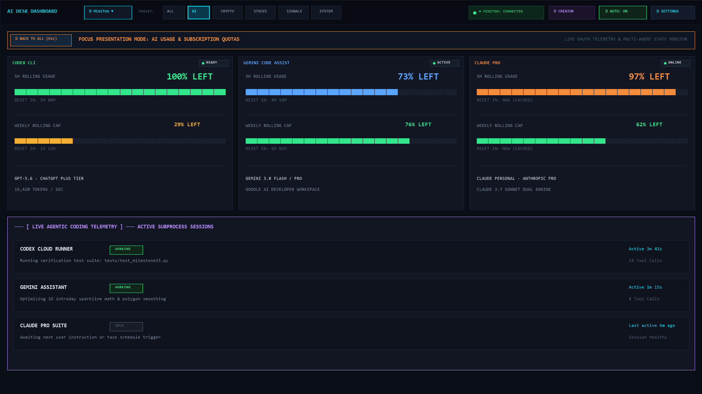
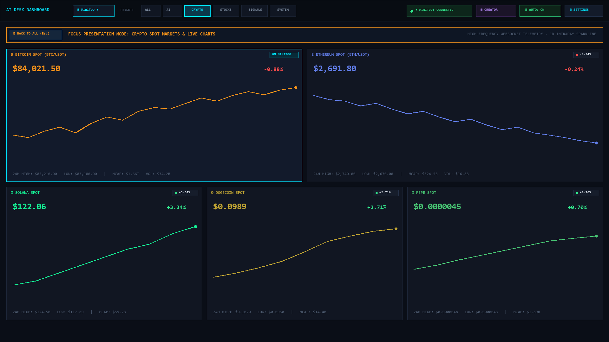
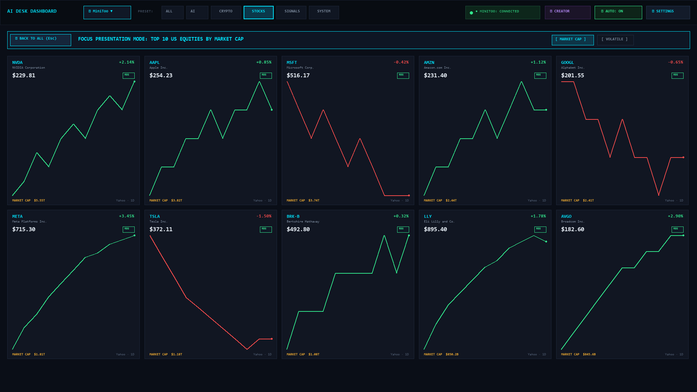
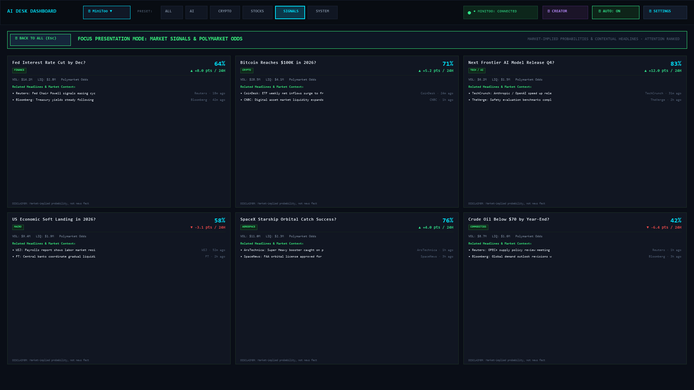
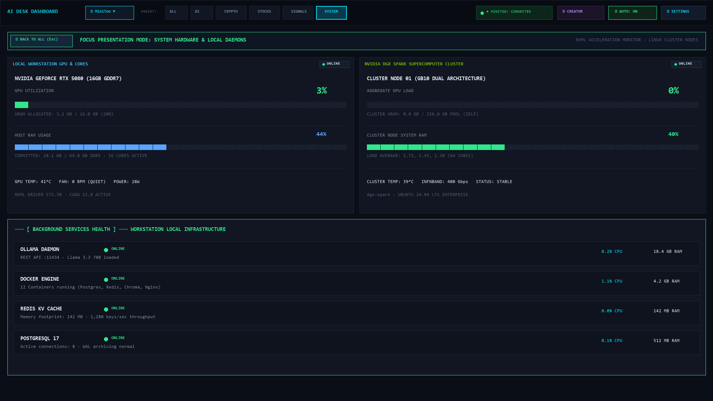

<div align="center">


# AI Desk Dashboard

> **"Your AI, markets, and machines — at a glance."**

A high-performance retro desktop command center and physical desk companion for AI usage quotas, live markets, dynamic stock cards, high-signal prediction odds, and workstation telemetry.

<div align="center">

[](https://www.python.org/)
[](https://www.microsoft.com/windows)
[](LICENSE)
[](#-supported-displays--modes)
[](docs/RELEASE_NOTES_v0.1.0.md)

<br/>


</div>

---

## 🎯 Core Sections at a Glance

<div align="center">
<table>
<tr>
  <td align="center"><b>🤖 AI Quotas & Diagnostic Profiles</b></td>
  <td align="center"><b>🪙 Crypto Markets (5-Asset Spot & Sparklines)</b></td>
</tr>
<tr>
  <td></td>
  <td></td>
</tr>
<tr>
  <td align="center"><b>📈 Top 10 US Equities by Market Cap</b></td>
  <td align="center"><b>🎲 Signals & Polymarket Prediction Odds</b></td>
</tr>
<tr>
  <td></td>
  <td></td>
</tr>
<tr>
  <td colspan="2" align="center"><b>💻 Workstation Telemetry & Remote DGX Clusters</b></td>
</tr>
<tr>
  <td colspan="2" align="center"></td>
</tr>
</table>
</div>

---

## 🖥️ Supported Displays & Modes

| Display Mode | Hardware | Communication | Capabilities |
| :--- | :--- | :--- | :--- |
| **Desktop-Only** | Any Windows PC | Native GUI (`tkinter` + PIL) | Full standalone command center. A missing physical device **never** hangs startup or breaks desktop features. |
| **MiniToo** | Divoom MiniToo | Bluetooth Classic / SPP | 160×128 color IPS LCD with live graphs, AI quota progress, and rotary knob channel navigation. |
| **Ditoo** | Divoom Ditoo / Plus | Bluetooth LE (GATT) | 16×16 RGB LED pixel matrix with rotating crypto/stock ticker animations and mechanical key control. |
| **Dual-Display** | MiniToo + Ditoo | SPP + BLE Concurrent | Stream full telemetry on MiniToo while streaming high-contrast pixel alerts on Ditoo simultaneously. |

---

## ⚡ Milestone 15 Highlights

- **First-Run Device Onboarding Wizard**:
  - Friendly 4-choice setup screen: `[ MiniToo ]`, `[ Ditoo ]`, `[ No physical display ]`, and `[ Detect automatically ]`.
  - Truthful Windows pairing guidance: launches `ms-settings:bluetooth` when pairing is required.
  - Interactive compact device status panel: `CONNECTED`, `CONNECTING`, `RECONNECTING`, `PAIRING REQUIRED`, `NOT FOUND`, `OFFLINE` with Reconnect, Forget, and Diagnostics controls.
- **Dynamic US Equities by Market Cap**:
  - Replaces tiny stock tables with a rich 10-card grid (5 cards/row × 2 rows at 1080p with responsive reflow).
  - 9 required fields per card: Symbol, Company Name, Price, Day Change %, Market Cap, Intraday 1D Sparkline, Market State, Source, Fetched At.
  - Corporate share-class deduplication: retains only the highest-cap class (e.g. `GOOGL` over `GOOG`, `BRK-B` over `BRK-A`).
  - Secondary mode toggle: switch seamlessly between **`[ MARKET CAP ]`** and **`[ VOLATILE ]`**.
- **Signals & Prediction Markets Intelligence**:
  - Public, read-only **Polymarket Gamma API** integration (zero wallets, zero keys, zero trading).
  - Explicit market-implied probability semantics (not asserted facts).
  - Deterministic **Attention Scoring** formula balances probability moves against volume and liquidity.
  - Curated financial RSS news headlines contextualized beneath signal cards.
- **Creator Capture Views (16:9 & 9:16 Shorts)**:
  - Clean composition stripped of settings chrome for OBS and mobile video production.
  - Vertical 9:16 stacked card format for YouTube Shorts, TikTok, and Instagram Reels.
- **Keyboard Shortcuts**:
  - `1`: ALL Preset
  - `2`: AI Quotas Preset
  - `3`: CRYPTO Markets Preset
  - `4`: STOCKS Equities Preset
  - `5`: SIGNALS Prediction Markets Preset
  - `6`: SYSTEM Hardware Preset
  - `Ctrl+,` or `Ctrl+P`: Settings Dialog
  - `F11`: Fullscreen presentation mode
  - `Esc`: Quick exit from Fullscreen / Creator Mode

---

## 🚀 Quick Start

### Path A: Windows App (No Python Required)
1. Download the standalone executable from [Releases](https://github.com/Tacdelgineer/Divoom-display/releases): `AI Desk Dashboard.exe`.
2. *(Optional)* Pair your Divoom MiniToo with Windows via Bluetooth Settings.
3. Launch `AI Desk Dashboard.exe`.
4. The dashboard automatically discovers your MiniToo COM port and begins live desktop rendering.
5. Click **SETTINGS** to customize sections, reorder cards, toggle presets, or configure Claude accounts.

### Path B: Developer Setup

```powershell
# 1. Clone the repository
git clone https://github.com/Tacdelgineer/Divoom-display.git
cd Divoom-display

# 2. Create and activate a virtual environment
python -m venv venv
.\venv\Scripts\Activate.ps1

# 3. Install dependencies
pip install -r requirements.txt

# 4. Launch Desktop Dashboard
python dashboard_app.py
```

See [docs/INSTALL.md](docs/INSTALL.md) for complete installation instructions and optional provider configurations.

---

## 📊 Supported Sections & Data Sources

### 1. Crypto Markets Section
- **Assets**: BTC (Bitcoin), ETH (Ethereum), SOL (Solana), DOGE (Dogecoin), PEPE (Pepe).
- **Data Source**: CoinGecko Public Markets API.
- **Efficiency**: Consolidated single HTTP request for all 5 assets with 60-second caching (`.crypto_cache.json`).
- **Formatting**: Large numbers formatted cleanly (e.g. `$84,021`), micro-cent tokens formatted intelligently up to 7 decimal places (`$0.0000045`), and compact notation on MiniToo 128px displays (`$4.5u`).
- **Visuals**: Recognizable badge badges (`₿`, `Ξ`, `◎`, `Ð`, `🐸`) and 24-point phosphor sparklines with daily high/low.

### 2. AI Usage Section
- **OpenAI Codex**: Authoritative chatgpt backend API via `~/.codex/auth.json`. Displays 5-Hour and Weekly `% LEFT`.
- **Google Gemini / Antigravity**: Live Google backend quota via headless `agy -p /usage`. Displays 5-Hour and Weekly `% LEFT`.
- **Anthropic Claude Diagnostics**:
  - Exposes active account identity with privacy masking (`no***@gmail.com`).
  - Reports subscription plan (`Claude Pro`) and authentication type (`Subscription (OAuth)`).
  - Probes environment variables (`ANTHROPIC_API_KEY`, `CLAUDE_CODE_OAUTH_TOKEN`, etc.) and documents precedence.
  - Supports isolated secondary authentication directories (`~/.claude-secondary`) without credential scraping or session hijacking.

### 3. Volatile Stocks Scanner Section
- **Definition**: Ranks top 10 most volatile US equities today using an objective intraday range metric:
  $$\text{Volatility \%} = \frac{\text{Day High} - \text{Day Low}}{\text{Previous Close}} \times 100$$
- **Pluggable Architecture**:
  - `YahooFinanceMarketDataProvider`: Public crumb-session provider for US liquid equities (no credentials required).
  - `FinnhubMarketDataProvider`: Pluggable commercial API provider via optional `FINNHUB_API_KEY`.
- **Display**: Symbol, current price, net day change %, intraday volatility %, and market state (`OPEN`, `POST`, `CLOSED`).

### 4. System & Services Section
- **Local PC**: GPU utilization, VRAM, GPU temperature (`nvidia-smi`), CPU and RAM utilization (`psutil`).
- **DGX Spark (Remote)**: SSH / Tailscale socket probe with local JSON cache and offline grace period.
- **Services Health**: Non-blocking TCP socket connect checks across local and remote container services (`:22`, `:11434`, etc.).
- **Coding Workspace**: Working directory Git branch, clean/dirty state, and active AI model.
- **AI Activity Monitor**: Real-time detection of local agent processes (Codex, Claude, Gemini) and active write logs.

---

## 🖥️ Supported Hardware

- **Divoom MiniToo**: 160×128 color IPS LCD display over Bluetooth SPP virtual serial port.
- **Divoom Ditoo / Ditoo Plus**: 16×16 RGB LED pixel matrix display over direct BLE GATT (`DitooPro-Light` / Microchip ISSC Transparent UART) or Bluetooth SPP.
- **Physical Controls**: MiniToo rotary knob (navigation) and Ditoo mechanical keys / lever.
- **Custom Display Channel**: Uses Channel 5 (Custom/DIY) and command `0x8B` to maintain host application ownership without firmware timeout to clock mode.
- **Desktop-Only Mode**: Completely standalone mode for developers without physical hardware.

---

## 🏛️ Architecture

```
┌────────────────────────────────────────────────────────────────────────┐
│                          DATA COLLECTORS                               │
│  MultiCrypto (CoinGecko) · Stocks Scanner (Yahoo/Finnhub) · Local PC   │
│  DGX Spark (SSH) · Codex · Gemini (Antigravity) · Claude Diagnostics   │
└───────────────────────────────────┬────────────────────────────────────┘
                                    │ Unified 60s/10s/2s polling intervals
                                    ▼
┌────────────────────────────────────────────────────────────────────────┐
│                        NORMALIZED STATE ENGINE                         │
│           DashboardState  ·  DataEngine  ·  DashboardConfig            │
│         Sections Order  ·  Cards Order  ·  Presets (ALL/AI/...)        │
└───────────────────┬────────────────────────────────┬───────────────────┘
                    │                                │
                    ▼                                ▼
┌───────────────────────────────────────┐ ┌──────────────────────────────┐
│           DESKTOP RENDERER            │ │       MINITOO RENDERER       │
│  Modular Sections & Presets (Tkinter) │ │   PIL 160x128 Framebuffer    │
│  Scrollable Canvas & Settings Dialog  │ │   Channel 5 Keep-Alive & Spp │
└───────────────────┬───────────────────┘ └──────────────┬───────────────┘
                    │                                    │ Bluetooth SPP
                    ▼                                    ▼
┌───────────────────────────────────────┐ ┌──────────────────────────────┐
│        Desktop Companion App          │ │        Divoom MiniToo        │
│        (Interactive Controller)       │ │     (Physical Hardware)      │
└───────────────────────────────────────┘ └──────────────────────────────┘
```

For detailed protocol specifications, SPP framing diagrams, and remote SSH flow, see [docs/ARCHITECTURE.md](docs/ARCHITECTURE.md).

---

## 🔒 Privacy & Security Model

- **100% Local Execution**: All metrics collection and rendering executes strictly on your local machine.
- **Zero Secret Ingestion**: The dashboard configuration (`config.json`) stores only UI preferences. It **never** stores API keys, OAuth tokens, or passwords.
- **Masked Account Identities**: Emails and account identifiers are strictly masked in diagnostics (e.g. `no***@gmail.com`).
- **Defense in Depth**: Subprocess invocations for local CLIs (`agy`, `git`, `ssh`) run directly via system binary paths without shell interpolation (`shell=False`).
- **No Third-Party Telemetry**: Zero analytics, trackers, or telemetry beacons.

---

## 🛠️ Development & Testing

```powershell
# Run full unit test suite (30 tests, mock-isolated)
pytest tests/ -v

# Run headless dashboard terminal status report
python dashboard.py --status

# Test hardware port auto-detection
python -c "from detector import detect_minitoo_port; print('Port:', detect_minitoo_port())"

# Export static 160x128 preview frames
python dashboard.py --preview

# Rebuild documentation screenshots
python tools/build_screenshots.py

# Build single-file executable using PyInstaller
pyinstaller "AI Desk Dashboard.spec"
```

For guidelines on repository structure and contributing, read [CONTRIBUTING.md](CONTRIBUTING.md).

For autonomous coding agents (Codex, Claude Code, Antigravity), see [AGENTS.md](AGENTS.md) and [docs/AGENT-QUICKSTART.md](docs/AGENT-QUICKSTART.md).

---

## 📄 License

This project is licensed under the **MIT License**. See the [LICENSE](LICENSE) file for details.
