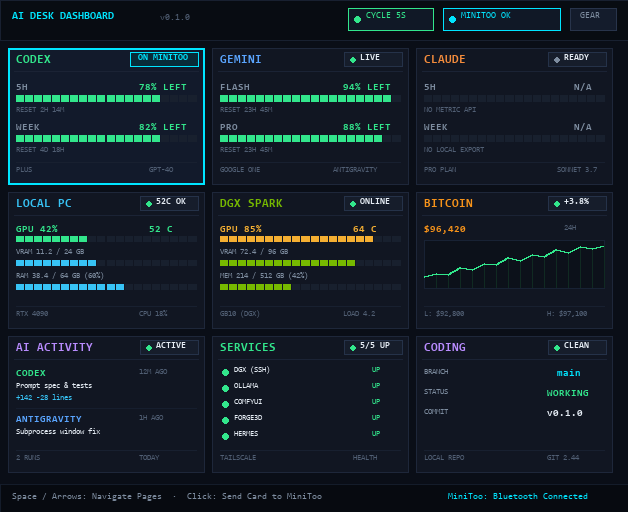
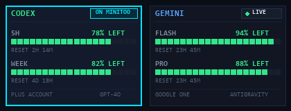
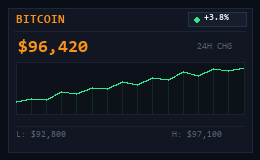
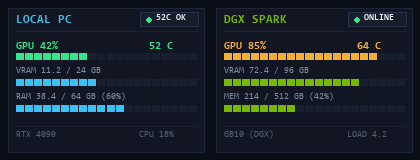
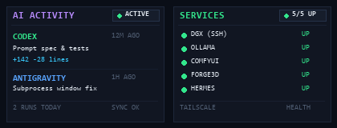

<div align="center">


# AI Desk Dashboard

**A retro desktop + physical desk dashboard for AI usage, system stats, agents, markets, and remote machines.**

[](https://www.python.org/)
[](https://www.microsoft.com/windows)
[](LICENSE)
[-00F5D4?style=flat-square)](#supported-hardware)
[](docs/RELEASE_NOTES_v0.1.0.md)

</div>

---

## ⚡ Highlights

- **Dual Display Model**: Run as a sleek standalone Windows desktop companion or stream 160×128 pixel frames live to a **Divoom MiniToo** desk display over Bluetooth SPP.
- **AI Quota Tracking (% LEFT)**: Tracks live, authoritative quotas for **OpenAI Codex** and **Google Gemini / Antigravity**, displaying actual percentage remaining and countdown to reset.
- **Physical Knob Navigation**: Turn the physical MiniToo volume dial clockwise or counter-clockwise to cycle dashboard cards with base-volume restoration (zero audio disruption).
- **GPU & Remote Node Telemetry**: Real-time local NVIDIA RTX telemetry (`nvidia-smi`) and remote Linux/DGX GPU cluster health via lightweight SSH/Tailscale socket probes.
- **Live Crypto Sparklines**: Real-time Bitcoin price and 16-point phosphor sparklines with automated local caching and API failover.
- **Zero-Flicker Background Architecture**: Engineered with strict non-blocking timeouts and Windows `CREATE_NO_WINDOW` wrappers—zero console window popping or UI lag.
- **Independent Component Failure**: Every data provider fails gracefully in isolation. If remote DGX is asleep or an AI CLI is unauthenticated, all other dashboard widgets continue updating normally.

---

## 📸 Screenshots

### 1. Desktop Dashboard Overview
The unified 3×3 desktop companion window displaying active MiniToo card sync, auto-cycling state, and live telemetry across all cards:

<div align="center">
  
</div>

### 2. AI Quota Cards (% LEFT)
Authoritative quota visualization showing percentage remaining, segmented progress bars, and reset countdowns:

<div align="center">
  
</div>

### 3. Bitcoin Live Sparkline
Real-time BTC ticker, 24-hour percentage delta, 16-point phosphor sparkline, and daily high/low range:

<div align="center">
  
</div>

### 4. GPU & Remote DGX Monitoring
Local workstation RTX GPU metrics alongside remote DGX Spark compute node load, VRAM, and system memory:

<div align="center">
  
</div>

### 5. AI Agent Activity & Tailscale Services
Recent coding agent activity feeds and TCP socket health checks across local and remote container services:

<div align="center">
  
</div>

### 6. MiniToo Physical Display
> **[Hardware Photo Placeholder]**  
> *To contributors/users: If you have a physical Divoom MiniToo running AI Desk Dashboard on your desk, feel free to submit a photo to `assets/screenshots/minitoo_desk_photo.jpg` via PR!*

---

## 🚀 Quick Start

### Path A: Windows App (No Python Required)
1. Download the standalone executable from [Releases](https://github.com/Tacdelgineer/Divoom-display/releases): `AI Desk Dashboard.exe`.
2. *(Optional)* Pair your Divoom MiniToo with Windows via Bluetooth Settings.
3. Launch `AI Desk Dashboard.exe`.
4. The dashboard automatically discovers your MiniToo COM port and begins live desktop rendering.
5. Click the **GEAR** icon to customize enabled pages, rotation speed, or autostart.

### Path B: Developer Setup

```powershell
# 1. Clone the repository
git clone https://github.com/Tacdelgineer/Divoom-display.git
cd Divoom-display

# 2. Create and activate a virtual environment
python -m venv venv
.\venv\Scripts\Activate.ps1

# 3. Install dependencies
pip install -r requirements.txt

# 4. Launch Desktop Dashboard
python dashboard_app.py
```

See [docs/INSTALL.md](docs/INSTALL.md) for complete installation instructions and optional provider configurations.

---

## 📊 Supported Data Sources

| Provider / Metric | Data Source | Freshness & Authority | Fallback Behavior |
| :--- | :--- | :--- | :--- |
| **OpenAI Codex** | Local CLI session (`~/.codex/auth.json`) | Authoritative backend API | Displays cached or `N/A` if unauthenticated |
| **Google Gemini / Antigravity** | Headless Antigravity CLI (`agy -p /quota`) | Authoritative Google backend | Displays plan tier or `LOCAL ONLY` |
| **Anthropic Claude** | Local workspace state & configuration | Transparent status display | Displays `N/A` (no calculated guesses) |
| **Local PC (GPU/RAM)** | `nvidia-smi` + `psutil` | Real-time authoritative (1–2s) | Hides GPU row if non-NVIDIA system |
| **DGX Spark (Remote)** | SSH / Tailscale socket probe | 3s timeout with local JSON cache | Shows `OFFLINE` badge; never freezes UI |
| **Bitcoin (BTC)** | Public CoinGecko / Binance API | 60s cache with live 16-point history | Preserves last-known sparkline on error |
| **AI Agent Activity** | Workspace logs & git commits | Real-time session parsing | Shows default ready status |
| **Services Health** | TCP socket probes (`:22`, `:11434`, etc.) | Non-blocking socket connect (0.3s) | Displays red dot for offline services |
| **Coding Status** | Working directory Git state | Subprocess git branch & diff | Displays directory name |

> [!NOTE]
> Integrations that query local developer tools (Codex, Antigravity, SSH) depend on those tools being installed and authenticated locally. The rest of the dashboard operates fully without them.

---

## 🖥️ Supported Hardware

- **Divoom MiniToo**: 160×128 color IPS LCD display over Bluetooth SPP.
- **Physical Controls**: MiniToo rotary knob (navigation) and side buttons.
- **Custom Display Channel**: Uses Channel 5 (Custom/DIY) to maintain host application ownership without firmware timeout to clock mode.
- **Desktop-Only Mode**: Completely standalone mode for developers without MiniToo hardware.

---

## 🏛️ Architecture

```
┌────────────────────────────────────────────────────────┐
│                   DATA COLLECTORS                      │
│   Codex  ·  Gemini  ·  Claude  ·  GPU  ·  DGX  ·  BTC   │
└──────────────────────────┬─────────────────────────────┘
                           │ Polls at provider-specific intervals
                           ▼
┌────────────────────────────────────────────────────────┐
│                 NORMALIZED STATE ENGINE                │
│       DashboardState  ·  DataEngine  ·  Config         │
└──────────────┬───────────────────────────┬─────────────┘
               │                           │
               ▼                           ▼
┌───────────────────────────┐ ┌───────────────────────────┐
│     DESKTOP RENDERER      │ │     MINITOO RENDERER      │
│  Tkinter Canvas (628x512) │ │   PIL 160x128 Framebuffer │
└──────────────┬────────────┘ └─────────────┬─────────────┘
               │                            │ Bluetooth SPP
               ▼                            ▼
┌───────────────────────────┐ ┌───────────────────────────┐
│     Desktop Companion     │ │       Divoom MiniToo      │
│     (Interactive UI)      │ │     (Physical Hardware)   │
└───────────────────────────┘ └───────────────────────────┘
```

For detailed protocol specifications, SPP framing diagrams, and remote SSH flow, see [docs/ARCHITECTURE.md](docs/ARCHITECTURE.md).

---

## 🔒 Privacy & Security Model

- **100% Local Execution**: All metrics collection and rendering executes strictly on your local machine.
- **Zero Secret Ingestion**: The dashboard configuration (`config.json`) stores only UI preferences (colors, page order, intervals). It **never** stores API keys, OAuth tokens, or passwords.
- **Defense in Depth**: Subprocess invocations for local CLIs (`agy`, `git`, `ssh`) run directly via system binary paths without shell interpolation (`shell=False`).
- **No Third-Party Telemetry**: Zero analytics, trackers, or telemetry beacons.

---

## 🛠️ Development & Testing

```powershell
# Run headless dashboard terminal status report
python dashboard.py --status

# Test hardware port auto-detection
python -c "from detector import detect_minitoo_port; print('Port:', detect_minitoo_port())"

# Export static 160x128 preview frames
python dashboard.py --preview

# Build single-file executable using PyInstaller
pyinstaller "AI Desk Dashboard.spec"
```

For guidelines on repository structure and contributing, read [CONTRIBUTING.md](CONTRIBUTING.md).

For autonomous coding agents (Codex, Claude Code, Antigravity), see [AGENTS.md](AGENTS.md) and [docs/AGENT-QUICKSTART.md](docs/AGENT-QUICKSTART.md).

---

## 🗺️ Roadmap

- [x] Multi-provider AI quota tracking (`% LEFT`)
- [x] Real-time GPU & DGX remote monitoring
- [x] Bitcoin price sparkline with local cache
- [x] Automatic Bluetooth SPP hardware discovery
- [x] Physical MiniToo knob navigation
- [x] Persistent settings & Windows autostart
- [x] Single-file zero-flicker Windows executable
- [ ] Linux and macOS desktop companion support
- [ ] Configurable HTTP JSON webhook collector
- [ ] Additional pixel display backends (Tidbyt, Pixoo 64)

---

## 📄 License

This project is licensed under the **MIT License**. See the [LICENSE](LICENSE) file for details.
